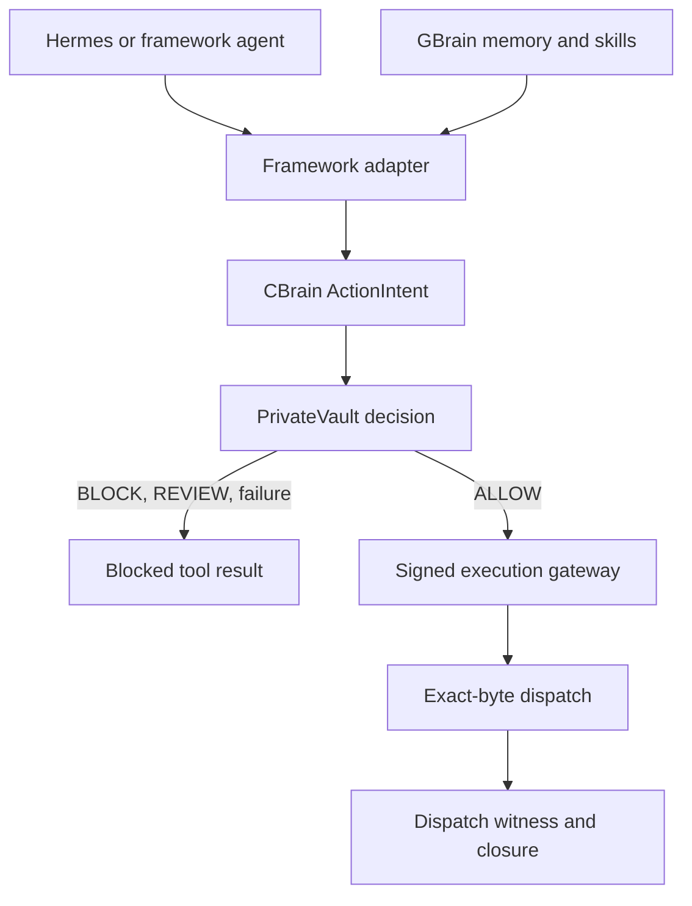

 # CBrain — Governed Runtime for Production AI Agents

CBrain is the execution-control layer between an AI agent’s plan and the systems it can affect.

It normalizes tool calls from agent frameworks, sends consequential actions to PrivateVault for an authoritative decision, and prevents execution unless the complete control path is available.

> **Status:** Production-runtime alpha. Hermes enforcement, GBrain MCP policy, PrivateVault decision integration, and exact-byte dispatch contracts are implemented. Physical execution remains closed until PrivateVault’s signed authorization, dispatch witness, and closure chain is connected.

## Architecture



A PrivateVault `ALLOW` decision is necessary, but it is not treated as sufficient execution authority.

## Responsibilities

| Component | Responsibility | Authority |
| --- | --- | --- |
| Hermes Agent | Planning, reasoning, and tool orchestration | No execution authority |
| GBrain | Memory, retrieval, graph knowledge, and skills | No execution authority |
| CBrain | Normalization, runtime invariants, routing, and fail-closed control | Enforces control availability |
| PrivateVault Agent DNA | Policy, authority, approval, decisions, and evidence | Sole decision authority |
| Execution gateway | Signed authorization, exact-byte dispatch, witness, and closure | Currently closed |
| RunPod/model providers | Model inference | No tool or secret authority |

## Implemented

Current branch:

```text
feature/production-agent-runtime-v0.1
```

### Governed Runtime Kernel

- Immutable `ActionIntent` capture
- Stable request and idempotency identities
- Immutable `GovernedExecution` results
- Runtime states:
  - `EXECUTED`
  - `BLOCKED`
  - `REVIEW_REQUIRED`
  - `CONTROL_FAILURE`
  - `INDETERMINATE`
- At-most-once handler entry
- No automatic retry after execution may have started
- Fail-closed control-plane behavior

### PrivateVault Decision Adapter

- Uses the real PrivateVault `/v1/decide` contract
- Supports:
  - `allow`
  - `require_approval`
  - `block`
- Strict status mapping:
  - `200` → `allow`
  - `202` → `require_approval`
  - `403` → `block`
- Rejects malformed, contradictory, redirected, oversized, and non-JSON responses
- HTTPS required except explicit localhost development
- No automatic retries
- Uses PrivateVault’s real `X-API-Key` authentication
- Requires a full-scope key
- Requires the key registry identity to match the configured agent identity

### Exact-Byte Dispatch Contract

`PreparedDispatch` binds execution to:

- Request identity
- Transport and destination
- Operation
- Exact outbound bytes
- Peer identity bytes
- Content type and encoding
- Tool identity
- Tool schema and artifact digests
- Credential audience
- Idempotency digest
- Retry-policy digest

An arbitrary Python callback is not considered proof of the bytes transmitted over the wire.

### Hermes Integration

Built against the real NousResearch Hermes plugin system.

- Official `pre_tool_call` hook
- Official `plugin.yaml` and `register(ctx)` packaging
- Unknown tools fail closed
- Missing session or tool-call identity fails closed
- PrivateVault failures become valid Hermes block directives
- Deterministic request IDs
- Mandatory `cbrain-hermes` launcher
- Startup refused unless:
  - `cbrain_guard` is loaded
  - CBrain owns the first pre-tool callback
  - The expected callback implementation is registered
- Rejects bypass flags including:
  - `--safe-mode`
  - `--ignore-rules`
  - `--ignore-user-config`
  - `--yolo`
- Plugin administration is blocked through the production launcher

Hermes documents hook and middleware failures as fail-open. CBrain catches control failures inside the hook and returns a valid blocking directive. The mandatory launcher prevents silent startup without enforcement.

### GBrain Integration

Built against the real Garry Tan GBrain repository and MCP server.

- Pinned version: `0.42.67.0`
- Real stdio MCP command: `gbrain serve`
- Hermes discovered 106 real GBrain tools
- Only 15 read/skill tools are exposed:
  - `get_page`
  - `list_pages`
  - `search`
  - `query`
  - `get_tags`
  - `get_links`
  - `get_backlinks`
  - `traverse_graph`
  - `get_timeline`
  - `get_stats`
  - `get_health`
  - `get_brain_identity`
  - `list_skills`
  - `get_skill`
  - `resolve_slugs`
- Writes, deletes, purges, uploads, jobs, source mutation, and admin operations are denied by default
- `GBRAIN_HOME` must be an absolute dedicated path
- Parent database environment variables are cleared for isolated PGLite operation
- API keys, authority grants, approvals, and signing material must never enter GBrain

Local verification:

```text
PGLite schema migrated through version 125
52/52 GBrain skills conformant
106 MCP tools discovered
15 tools selected
```

## Current Enforcement State

| PrivateVault result | Current behavior |
| --- | --- |
| `block` | Tool call blocked |
| `require_approval` | Tool call blocked with review reference |
| `allow` | Blocked until signed execution gateway is connected |
| Timeout or authentication failure | Tool call blocked |
| Unknown tool | Tool call blocked |
| Malformed response | Tool call blocked |
| Adapter failure | Tool call blocked |

A decision receipt is not treated as execution authorization.

## Upstream Pins

Exact upstream identities are stored in [`upstreams.lock.json`](upstreams.lock.json).

| Component | Repository | Pinned commit |
| --- | --- | --- |
| Hermes Agent | `NousResearch/hermes-agent` | `f3cda0ceb18d8ba7465a6d223098ef0e56c8fee1` |
| GBrain | `garrytan/gbrain` | `c6dc0adf26a2d20df1147d2ec87c8922ca86d410` |
| PrivateVault Agent DNA | `LOLA0786/privatevault-agent-dna` | `eabc02e806fe4804d7422556af3d1b376742ccfc` |

Upstream changes require review and conformance testing before these pins are updated.

## Framework Dependencies

The reproducible dependency graph includes optional packages for:

- LangChain
- LangChain OpenAI
- CrewAI
- Microsoft AutoGen Core
- Microsoft AutoGen AgentChat
- Microsoft AutoGen OpenAI extensions

These packages are locked in `uv.lock`.

Concrete framework adapters are the next milestone. Framework adapters will translate native calls into `ActionIntent`; they will not contain separate policy logic or bypass PrivateVault.

## Secrets

Production invariants:

- Model-provider keys never enter prompts
- Secrets never enter GBrain
- Secrets never enter tool arguments or decision reasons
- PrivateVault credentials are read from an absolute mounted secret file
- Credentials are loaded at request time to support rotation
- Raw credentials are never committed
- Production will use workload identity, a secret manager, or a credential broker
- Execution, witness, and closure signing keys remain outside the agent process

## Installation

Python 3.12 or newer is required.

```bash
git clone git@github.com:LOLA0786/cbrain.git
cd cbrain
git checkout feature/production-agent-runtime-v0.1

uv sync --extra dev
```

Optional dependency groups:

```bash
uv sync --extra frameworks
uv sync --extra privatevault
```

Do not install the heavy framework group in Google Cloud Shell. Build it through the remote container pipeline.

## Verification

```bash
uv run ruff check cbrain integrations tests
uv run mypy cbrain
uv run pytest -q
uv lock --check
git diff --check
```

Current verification:

```text
129 tests passed
Ruff clean
Production-source mypy clean
Dependency lock consistent
```

## Project Layout

```text
cbrain/
├── adapters/
│   ├── gbrain.py
│   ├── hermes.py
│   ├── privatevault.py
│   └── privatevault_http.py
├── contracts.py
├── dispatch.py
├── engine.py
├── hermes_launcher.py
├── ports.py
├── runtime.py
└── types.py

integrations/
└── hermes/
    └── cbrain_guard/

tests/
upstreams.lock.json
uv.lock
pyproject.toml
AGENTS.md
```

## Security Invariants

1. Every consequential action is normalized before execution.
2. Framework adapters translate; they do not authorize.
3. PrivateVault is the sole decision authority.
4. BLOCK, REVIEW, unknown, malformed, and unavailable states do not execute.
5. Tool execution is at most once.
6. Indeterminate execution is never automatically retried.
7. Unknown tools are denied by default.
8. Secrets never enter model-visible memory or arguments.
9. Upstream implementations are pinned.
10. An `ALLOW` decision does not replace signed execution authorization.
11. Outbound bytes and peer identity must match the signed permit.
12. Execution requires authorization, a dispatch witness, and closure evidence.

## Remaining Work

1. Connect PrivateVault signed execution authorization
2. Bind exact outbound bytes and peer identity
3. Create the independent dispatch witness
4. Record and verify execution closure
5. Add LangChain integration
6. Add CrewAI integration
7. Add AutoGen intervention handlers
8. Add RunPod/OpenAI-compatible model routing
9. Add workload identity and secret-manager providers
10. Add durable approvals, queues, idempotency, and recovery
11. Add OpenTelemetry, metrics, and structured audit export
12. Add adversarial, failure-injection, load, and end-to-end tests
13. Build signed containers, SBOMs, CI gates, and deployment runbooks

## Positioning

- **Hermes:** reasoning and agent runtime
- **GBrain:** memory and skills
- **CBrain:** governed execution runtime
- **PrivateVault:** authorization, enforcement, and verifiable evidence

CBrain’s purpose is not to make an agent appear safe.

Its purpose is to make unauthorized or unverifiable execution impossible.

---

Built by Chandan Galani.
