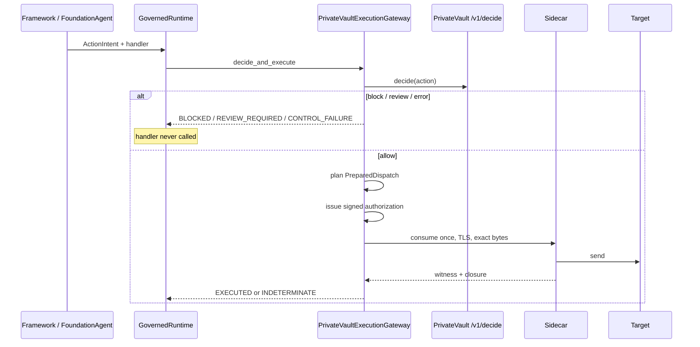

# CBrain architecture

This is the map of the repository: what each layer is allowed to do, how a
tool call becomes an effect, and where to look when the code has grown.

Read this first. Then `AGENTS.md` for invariants, `README.md` for setup.

## 1. What this system is

CBrain is the **framework-neutral governance harness between agent planning
and real tool execution**. It does not plan. It does not decide policy in
production. It captures an immutable action, demands an authoritative
decision, and refuses to treat “the model said so” as permission to act.

PrivateVault Agent DNA (a pinned upstream, not this repo) is the **only**
production component allowed to authorize dispatch. CBrain enforces that the
control path exists, that a tool handler runs at most once, and that
uncertain outcomes are never retried.

```text
Plan (Hermes / FoundationAgent / other framework)
        │  tool proposal, no secrets, no policy
        ▼
Translate (adapters/)          ← never decide
        │
        ▼
Capture  ActionIntent          ← frozen bytes, request_id, capability
        │
        ▼
Govern   GovernedRuntime       ← at-most-once, fail-closed
        │
        ▼
Decide   PrivateVault gateway  ← allow | require_approval | block
        │
        ├── block / review / control failure → no tool handler
        └── allow
                │
                ▼
        Plan exact bytes  PreparedDispatch
                │
                ▼
        Issue + consume one-use permit
                │
                ▼
        Sidecar send / witness / close
                │
                ▼
        Target (CRM, ledger, HTTP API, …)
```

A PrivateVault `ALLOW` is **necessary, not sufficient**. Execution also
requires signed authorization, atomic single-use consumption, exact-byte
dispatch, a witness of the bytes and peer actually observed, and closure.

## 2. Authority — who may do what

| Actor | May | Must not |
| --- | --- | --- |
| Model / provider | Propose tool calls or text | Choose URLs, credentials, routes, policy, or retry |
| Framework (Hermes, LangChain, …) | Orchestrate turns | Authorize or execute around CBrain |
| Adapter (`cbrain/adapters`) | Translate wire formats into `ActionIntent` | Contain policy |
| `GovernedRuntime` | Enforce handler and status invariants | Invent allow/block |
| PrivateVault | Decide allow / review / block and sign evidence | Live in this repository |
| Sidecar | Consume permit, hold target credentials, send exact bytes, witness | Accept model-provided destinations |
| Simulator / business target | Enforce ordinary domain rules | Authorize the agent |
| GBrain | Memory and read-only skills | Hold secrets or grant authority |
| Company eval gateway | Scripted ALLOW/REVIEW/BLOCK for fixtures | Be reported as PrivateVault or live-model quality |

**Non-negotiable invariants** (also in `AGENTS.md`):

1. Every consequential tool call enters `GovernedRuntime`.
2. Adapters translate; they never decide policy.
3. PrivateVault is the only production authorizer of dispatch.
4. `BLOCKED`, `REVIEW_REQUIRED`, and `CONTROL_FAILURE` never run the tool.
5. One request invokes its handler at most once.
6. Possible execution without proven closure is `INDETERMINATE`.
7. `INDETERMINATE` is never automatically retried.
8. Secrets never enter model context, GBrain, arguments, or logs.
9. Production integrations use commits pinned in `upstreams.lock.json`.
10. Test doubles live only under `tests/`.

## 3. Glanceable package map

```text
cbrain/                      Python package (import cbrain)
├── contracts.py             ActionIntent, GovernedExecution, ExecutionStatus
├── ports.py                 PrivateVaultGateway protocol, ToolHandler
├── runtime.py               GovernedRuntime — the kernel
├── dispatch.py              PreparedDispatch — exact outbound bytes
├── consumption.py           Atomic one-use authorization claim
├── hermes_launcher.py       Fail-closed Hermes process wrapper
│
├── adapters/                Translation only
│   ├── framework.py         Shared fail-closed framework guard
│   ├── hermes.py            pre_tool_call → ActionIntent / block directive
│   ├── gbrain.py            Read-only GBrain tool allow-list
│   ├── privatevault.py      /v1/decide client and verdict mapping
│   ├── privatevault_http.py HTTPS transport for decisions
│   ├── privatevault_claim.py    Authorization claim coordinator
│   ├── privatevault_execution.py Binding + Agent DNA verification
│   └── privatevault_consumption.py Store-backed consume-once
│
├── execution/               Production dispatch chain
│   ├── gateway.py           PrivateVaultExecutionGateway
│   ├── planner.py           Intent → PreparedDispatch (catalog-owned)
│   ├── authorize_client.py  Signed permit issuance
│   ├── transport.py         In-process dispatch (not witness-independent)
│   └── sidecar.py           Independent sole-egress dispatcher
│
├── models/                  Inference only — no policy, no tools
│   ├── contracts.py         complete(messages, tools) → ToolCall | TextOutput
│   ├── router.py            Deployment-owned route IDs
│   ├── transport.py         HTTPS JSON; credentials at request time
│   ├── anthropic.py, openai_compatible.py, google.py
│   ├── instrumented.py      Usage/latency wrappers for eval
│   └── usage.py             Token accounting
│
├── knowledge/               Untrusted RAG/graph context (never authority)
│   ├── contracts.py / ports.py
│   ├── ingestion.py / retrieval.py / graph.py
│   └── stores/              In-memory, PostgreSQL/pgvector, Redis cache
│
├── agent/                   Reusable bounded reasoning loop
│   ├── foundation.py        FoundationAgent
│   ├── profile.py           Identity, instructions, limits, tool allow-list
│   ├── tools.py             GovernedTool + ToolRegistry
│   ├── durable.py           DurableRunState + StoredRunRecord
│   ├── durable_loop.py      Crash/resume transitions
│   ├── store_memory.py / store_sqlite.py
│   └── limits.py            Turn, tool, timeout bounds
│
├── company/                 Four config-driven agents on FoundationAgent
│   ├── kinds.py             gtm | operations | legal | accounts
│   ├── profiles.py, tools.py, spec.py, risk.py
│   ├── authority.py         CompanyExecutionContext (legal matter scope)
│   ├── validation.py        Money/legal checks before REVIEW
│   ├── handlers.py          Simulator-backed tool handlers
│   └── simulators.py        Fixture bundles
│
├── simulators/              Mutable CRM + ledger — business rules only
├── evaluation/              Deterministic catalogs, harnesses, CLI
│   └── company_gateway.py   CompanyRiskGateway (company_test_gateway)
└── deploy/                  JSON deployment config (fail at startup)

integrations/hermes/cbrain_guard/   Packaged Hermes plugin
skills/govern-cbrain-execution/     Agent skill for this boundary
docs/                               This file and topic guides
tests/                              Only place for test doubles
migrations/postgres/                Consumption-store schema
upstreams.lock.json                 Pinned Hermes / GBrain / PrivateVault
```

Root public API (`import cbrain`): `ActionIntent`, `GovernedRuntime`,
`GovernedExecution`, `ExecutionStatus`, `PrivateVaultGateway`, `ToolHandler`.

## 4. Kernel contracts

### 4.1 `ActionIntent`

Captured **before** authorization. Frozen JSON bytes for arguments, context,
and evidence. Identity fields: `request_id`, `idempotency_key`, `agent_id`,
`framework`, `tool_name`, `capability`. Callers use `ActionIntent.capture(...)`.

The intent is the unit of comparison for “same action, same decision.”
Request IDs, timestamps, and tool-call IDs are not part of canonical
decision identity (see company eval hashing).

### 4.2 `GovernedExecution` and `ExecutionStatus`

| Status | Tool ran? | Meaning | Retry? |
| --- | --- | --- | --- |
| `EXECUTED` | yes | Handler entered; effect may exist | No auto-retry |
| `BLOCKED` | no | Policy or validation refused | Not as the same request |
| `REVIEW_REQUIRED` | no | Approval required | Not until approved |
| `CONTROL_FAILURE` | no | Control path missing or invalid **before** send | Operator repair, then new request |
| `INDETERMINATE` | unknown | Send or handler **may** have started; closure unproven | **Never** automatically |

`GovernedRuntime.execute(action, handler)` wraps the handler so it can run
at most once. If the gateway errors after the handler may have run, or if
the gateway declares `independent_execution`, the result is `INDETERMINATE`.

### 4.3 `PreparedDispatch`

Binds the eventual wire send to request identity, transport, destination,
operation, **exact outbound bytes**, peer identity, content type, tool
schema/artifact digests, credential audience, and retry-policy digest.
A Python callback is not proof of what left the machine.

Destinations, credential audiences, TLS peers, and digests come from
**deployment/catalog config**, never from model arguments.

### 4.4 Gateway protocol

Anything plugged into `GovernedRuntime` must satisfy `PrivateVaultGateway`:

```python
independent_execution: bool
def decide_and_execute(action, handler) -> GovernedExecution
```

Production: `PrivateVaultExecutionGateway`.
Offline company fixtures: `CompanyRiskGateway` (`decision_authority` =
`company_test_gateway`). Do not mix those claims in reports.

## 5. Workflows

### 5.1 Production consequential tool call



Failure **before** the handler/send is `CONTROL_FAILURE` (retryable only as a
new request after the control plane is healthy). Failure **after** send may
have started is `INDETERMINATE`.

The in-process transport is a unit-test double only. It cannot produce
`EXECUTED` against real Agent DNA: it returns no closure, and the gateway will
not seal one. Production egress is the sidecar, which:

- runs outside the agent process
- never receives model-provider or target secrets from the agent
- resolves credentials from `credential_audience`
- allow-lists destinations (model URLs are never dialed)
- verifies TLS peer digest against the permit
- consumes the permit immediately before send
- signs witness and closure from observed bytes and peer

### 5.2 Foundation agent turn loop

`FoundationAgent` is the reusable loop that company agents configure rather
than fork.

```text
RunInput(task)
    → model complete(messages, permitted tools)
    → TextOutput        → finish (COMPLETED / limits)
    → ToolCall          → capability check
                        → ActionIntent.capture
                        → GovernedRuntime.execute(handler)
                        → append tool result, next turn
```

Constraints live on `AgentProfile`: `permitted_tools`, `max_model_turns`,
`max_tool_calls`, `timeout_seconds`. Unknown tools never reach the runtime.
Timeouts are cooperative **between** turns; an in-flight model or handler
call is not aborted.

Optional durability (`RunStore`: memory or SQLite):

| Durable state | Meaning |
| --- | --- |
| `RUNNING` | Loop in progress |
| `TOOL_PREPARED` | Intent captured, not yet executed (crash window) |
| `TOOL_IN_FLIGHT` | Handler/dispatch started |
| `TOOL_COMPLETED` | Result in store, not yet folded into messages |
| `RECOVERY_REQUIRED` | Needs operator/resume, not a silent retry of INDETERMINATE |
| `COMPLETED` / `FAILED` / `CANCELLED` | Terminal |

Concurrent `run()` on one `FoundationAgent` instance is not supported.
Concurrent resume of the **same** `run_id` is tested: one worker executes,
observers see `EXECUTION_IN_FLIGHT`.

PrivateVault is optional at this layer: inject any `PrivateVaultGateway`.
`FoundationAgent` does not import `agent_dna`.

### 5.3 Hermes production path

1. Process **must** start via `cbrain-hermes` (`hermes_launcher.py`).
2. Startup fails unless plugin `cbrain_guard` is loaded and owns the first
   `pre_tool_call` callback.
3. Dash-prefixed argv is allow-listed (currently empty); aliases and bundled
   shorts are refused with exit 78.
4. The hook maps the tool to a capability (default deny), captures
   `ActionIntent`, asks PrivateVault, and returns a Hermes **block**
   directive on everything except a fully composed execution gateway.
5. Hermes itself is fail-open on hook errors; CBrain catches those and
   still returns a valid block.

GBrain is attached as memory only. Writes, deletes, admin, and secret-shaped
tools are denied. Pins live in `upstreams.lock.json`.

### 5.4 Company agents (configuration, not new runtimes)

Four kinds share one `FoundationAgent`: **GTM, Operations, Legal, Accounts**.
A fifth kind, **Coding**, and a sixth, **Procurement**, are configured the same
way but are exercised through the operator loop (approval resume), not the
200-case × 6-route fixture matrix.

| Kind | Typical allow / review / block |
| --- | --- |
| GTM | CRM search/research allow; outbound mail review |
| Operations | Health/runbooks allow; restart/propose review |
| Legal | In-scope extract/search allow; sign/commit block or review; matter isolation |
| Accounts | Reads allow; prepare/execute payment review; invalid money **block** |
| Coding | Search/read/test allow; patch/PR review; force-push and secrets **block** |
| Procurement | Replica lookup and registered-vendor RFQ allow; award/PR/PO **review**; bank change and ERP payment **block** |

Legal scope comes from `CompanyExecutionContext` (deployment-owned
`permitted_matter_ids`), not from the model widening `matter_id`.
Invalid money uses `Decimal` only; it is BLOCK, never REVIEW, and never
reaches the handler. Procurement RFQs use registered `vendor_id`s from ERP
replica extracts (Oracle, SAP, SQL Server tags). The model never receives a
DSN or chooses a vendor email. See `docs/procurement-agents.md`.

`CompanyRiskGateway` is a **fixture/eval** mapping of tool risk + validation
onto the same `ExecutionStatus` values. Reports must say
`decision_authority = company_test_gateway` and must not claim PrivateVault
invariance or live-model quality.

**Operator loop** (`cbrain/company/approval.py`, `evaluation/operator_loop.py`):
Accounts, Legal, Coding, and Procurement REVIEW tools are parked as the same
`ActionIntent`. An identity adapter supplies an authenticated principal, while a
deployment-owned directory binds Accounts to a controller, Legal to counsel,
Coding to a code reviewer, and Procurement to a buyer lead. The role-bound
approval may run the handler **once**; a replacement approval or second
completion is blocked. A frozen inbox never approves or dispatches. A pre-send
freeze is `CONTROL_FAILURE` with `tool_executed=false`; possible execution after
a send begins is `INDETERMINATE`, frozen, and never retried. Evidence packs
record intent digest, statuses, role, approver identity, execution certainty,
and retryability — not tool arguments. Procurement award proofs may carry
PrivateVault receipt digests only when `build_privatevault_procurement_proof`
re-verifies a `VerifiedClosure` from the PrivateVault adapter. Offline fixtures
must use `build_procurement_proof` and must not claim PrivateVault.

### 5.5 Evaluation — four layers, four claims

Do not collapse these into one “the suite passed” sentence.

| Layer | Module | What it measures | What it does not |
| --- | --- | --- | --- |
| Domain scenarios | `evaluation/catalog.py`, `harness.py` | Gate disposition for identical `ActionIntent`s; activation frequency | That models propose equally safe actions |
| Five-provider matrix | `evaluation/model_matrix.py` | Exact canonical proposals vs text vs unmatched | Live zero-divergence unless a recorded live run says so |
| Agent cost/quality | `evaluation/agent_harness.py` | Offline fixture conformance, usage, **honest incomplete cost** | Production cost optimization while data is incomplete |
| Company agents | `evaluation/company_*.py` | 200 scripted cases × 6 route IDs = 1200 fixture runs; safety gates; **within-case** route invariance | Real-model quality, live providers, PrivateVault decisions |
| Operator loop | `evaluation/operator_loop.py` | Role-bound approval resume; one-shot execution; explicit pre-send freeze-closed cases | Live models, PrivateVault, authenticated identity adapter, production sidecar |

Company route invariance (the load-bearing rule):

- Partition by `case_id` first. Same tool+args in different cases are not replicas.
- Each cohort must contain **exactly** the configured routes (no missing row, no duplicate).
- Crash/concurrency cases that performed an action must record ActionIntent hash + policy decision, or the comparison is **incomplete** and the gate fails closed.
- Only cases with `expect_action_intent = false` may be **not applicable** when hashes are absent.
- Provenance on every run: `execution_mode=offline_fixture`, `model_output_source=scripted`, `provider_called=false`, `simulated_route_label=simulated:{route}`.

CLI: `cbrain-eval` (`catalog`, `scenario`, `model-plan`, `model-generate`,
`agent-plan`, `agent-run`, `company-plan`, `company-run`, `operator-plan`,
`operator-run`).

Live provider calls require `--confirm-live-api`. Offline company runs never
call providers.

## 6. Models and secrets

Neutral interface: `complete(messages, tools) -> ToolCall | TextOutput`.

Routes (`openai`, `anthropic`, `google`, `xai`, `runpod`, plus `offline` in
eval) are deployment-owned. A completion cannot select a provider URL or
credential. Keys are resolved when HTTPS starts, as transport headers, never
as message content. Tool schemas and returned arguments reject
credential-shaped keys. Multiple simultaneous tool calls are refused rather
than reordered.

## 7. Simulators vs policy

`cbrain/simulators` (CRM, ledger, HTTP) hold **real mutable state** and
ordinary business consistency (idempotency, JSON shape, credential digest).
They contain **no authorization policy**.

The ledger **intentionally** allows a business-valid APP-fraud chain
(raise limit → add beneficiary → transfer). The control plane, not the
ledger, is what must refuse unauthorized sequences.

`SimulatorDispatchPlanner` maps `ActionIntent` → `PreparedDispatch` using
the immutable catalog, not model-supplied URLs.

## 8. How work should flow through the repo

```text
New framework          → adapters/ + integrations/     (translate only)
New model provider     → models/                       (wire format only)
New business target    → simulators/ + catalog route   (no policy)
New production policy  → PrivateVault (upstream pin)   (not this repo)
New company tool       → company/tools + risk + handler + scenarios
New operator task      → evaluation/operator_tasks.py (accounts/legal/coding)
New eval claim         → evaluation/ + tests that forbid overclaim
Runtime invariant      → contracts.py / runtime.py / tests/test_runtime.py
```

If you need a second policy engine inside CBrain, you are in the wrong
repository.

## 9. Tests and verification

| Area | Tests |
| --- | --- |
| Kernel | `test_p0_contracts.py`, `test_runtime.py`, `test_dispatch.py` |
| PrivateVault adapters | `test_privatevault_*.py` (test doubles in `tests/` only) |
| Sidecar / consumption | `test_independent_sidecar.py`, `test_consumption.py` |
| Foundation / durable | `test_foundation_agent.py`, `test_durable_agent_runs.py` |
| Company | `test_company_agents.py`, `test_company_eval_safety.py` |
| Models / eval | `test_model_*.py`, `test_evaluation_*.py`, `test_agent_*.py` |
| Hermes | `test_hermes_*.py` |

Before commit (`AGENTS.md`):

```bash
python -m pytest -q
python -m compileall -q cbrain tests
git diff --check
```

Typical PR bar: `ruff check cbrain integrations tests`, `mypy cbrain`,
`uv lock --check`. CI also checks out **pinned** PrivateVault Agent DNA
for a small real-conformance set.

## 10. What this repo is not

- Not a model-quality benchmark (company `real_model_quality = not_evaluated`).
- Not PrivateVault. Do not vendor or copy Agent DNA into `cbrain/`.
- Not a place for secrets, live keys, or unpinned production integrations.
- Not “zero divergence across models” unless a **recorded live** run with
  identical `ActionIntent` bytes says so — and even then that is gate
  invariance, not “models are equally safe.”
- LangChain / CrewAI / AutoGen: shared fail-closed guard exists; native
  execution wrappers are still to be wired to the concrete gateway.

## 11. Topic guides

| Doc | Use when |
| --- | --- |
| `AGENTS.md` | Invariants you must not break |
| `README.md` | Install, pins, current enforcement table |
| `docs/foundation-agent.md` | Writing a new agent on `FoundationAgent` |
| `docs/company-agents-offline-eval.md` | Company suite claims and provenance |
| `docs/domain-evaluation-v0.1.md` | CRM/ledger catalog and APP-fraud scenario |
| `skills/govern-cbrain-execution/SKILL.md` | Building or reviewing a governed integration |
| `upstreams.lock.json` | Exact Hermes / GBrain / PrivateVault commits |

When documentation and code disagree, **code plus tests win**. Update this
file in the same change that moves an authority boundary.
